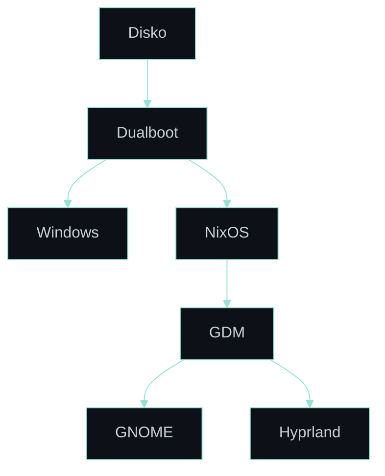

<div align="center">
  
  <h1>NixOS dotfiles</h1>
</div>

<div align="center">
  
  
  
  
  
  
  
  
  
  <a href="https://github.com/RomeoCavazza/nixos-config/actions/workflows/ci.yml"></a>
</div>

NixOS dotfiles for a single-host workstation, tailored to my Legion. Inspired by [fufexan/dotfiles](https://github.com/fufexan/dotfiles) and hardened around ANSSI recommendations, with influence from [Sécurix](https://github.com/cloud-gouv/securix) and [Bureautix](https://github.com/cloud-gouv/bureautix-example) by [cloud-gouv](https://github.com/cloud-gouv).

The [GitHub Wiki](https://github.com/RomeoCavazza/nixos-config/wiki) is the primary reference:

- [Architecture](https://github.com/RomeoCavazza/nixos-config/wiki/Architecture) — how the flake, profiles, and modules assemble the machine.
- [Security](https://github.com/RomeoCavazza/nixos-config/wiki/Security) — disk encryption, verified boot, secrets, and backups.
- [Observability](https://github.com/RomeoCavazza/nixos-config/wiki/Observability) — dashboards, correlation logs, and live snapshots.

## Desktop

> [!TIP]
> GDM offers both desktops at login — switch between **Hyprland** (Wayland) and **GNOME** without friction.




| GNOME | Hyprland |
|:---:|:---:|
|  |  |

<br>

## Features

### Code Environment


<br>

### Virtualization


<br>

### Hardware and Modeling


<br>

### NVIDIA Prime


---

## Live Infrastructure


<p align="left">
  
  
  
</p>

Prometheus, Loki, Grafana, and Promtail provide local observability. The snapshots committed on the `snapshots` branch are documentation artifacts only, refreshed by a systemd timer when the visual delta exceeds 0.3%. Live operations stay in Grafana.

- [NixOS Metrics](https://raw.githubusercontent.com/RomeoCavazza/nixos-config/snapshots/docs/assets/live/live-dashboard.png) — current pressure and rebuild cost
- [Nix Efficiency](https://raw.githubusercontent.com/RomeoCavazza/nixos-config/snapshots/docs/assets/live/nix-efficiency.png) — freshness, generation debt, closure structure
- [Incident Correlation](https://raw.githubusercontent.com/RomeoCavazza/nixos-config/snapshots/docs/assets/live/incident-dashboard.png) — pressure spikes mapped to Loki logs

Details on the [Observability](https://github.com/RomeoCavazza/nixos-config/wiki/Observability) wiki page.

---

## Security and Backups

The disk is LUKS2-encrypted and unlocked by a TPM2 keyslot bound to PCR 7 behind Secure Boot ([Lanzaboote](https://github.com/nix-community/lanzaboote)). The [disko](https://github.com/nix-community/disko) layout keeps Windows and WinRE beside an encrypted Btrfs filesystem with `@root`, `@nix`, `@home`, `@persist`, and `@swap`. `@root` is recreated at boot; durable service, identity, desktop, and network state is bind-mounted from `@persist`. Secrets are committed only in encrypted form under [`secrets/`](./secrets/) with [sops-nix](https://github.com/Mic92/sops-nix). Four `restic` jobs back up critical configuration, desktop data, GitLab state, and Sigma/RAG source data to Backblaze B2. A weekly non-destructive restore drill validates the critical backup. Full model on the [Security](https://github.com/RomeoCavazza/nixos-config/wiki/Security) wiki page.

---

## Services

**GitLab CE** runs natively via `services.gitlab` (no Docker) on `gitlab.localhost:8930`, backed by a local PostgreSQL instance. GitLab Pages serve on `pages.localhost:8931`. One persistent shell `gitlab-runner` handles local CI/CD and can access Docker through its group membership. SMTP routes through a Gmail App Password. GitLab, Rails, ActiveRecord, runner, and SMTP credentials are SOPS-encrypted in [`secrets/gitlab.yaml`](./secrets/gitlab.yaml).

---

## Installation

> [!IMPORTANT]
> This configuration targets a specific host — review hardware IDs, filesystems, secrets, and service assumptions before reusing it. Features are enabled by composing profiles in [`profiles/`](./profiles/), which the host assembles in [`hosts/legion/profiles.nix`](./hosts/legion/profiles.nix).

Prerequisites: a [NixOS 26.05 ISO](https://channels.nixos.org/nixos-26.05/latest-nixos-graphical-x86_64-linux.iso) on a bootable USB ([Ventoy](https://www.ventoy.net/en/download.html) or [Rufus](https://rufus.ie/en/)).

```bash
# 1. Clone the persistent checkout on @home
git clone https://github.com/RomeoCavazza/nixos-config.git ~/nixos-config

# 2. Apply
cd ~/nixos-config
sudo nixos-rebuild switch --flake .#legion
```

The activation recreates `/etc/nixos` as a symlink to `/home/tco/nixos-config`. Disk provisioning, Secure Boot enrollment, TPM enrollment, SOPS key installation, and migration into `@persist` are separate recovery-sensitive operations; review the [Security](https://github.com/RomeoCavazza/nixos-config/wiki/Security) page before applying this host configuration to a fresh disk.

This dotfile is not a monolith — it is composed from small, single-purpose repositories, each pinned as a flake input and documented on its own:

| Icon | Repository | Role |
|:---:|---|---|
|  | [`hyprland-config`](https://github.com/RomeoCavazza/hyprland-config) | Hyprland compositor, Waybar, Rofi, foot |
|  | [`conky-config`](https://github.com/RomeoCavazza/conky-config) | Transparent Conky telemetry rails |
|  | [`hypr-canvas`](https://github.com/RomeoCavazza/hypr-canvas) | Native infinite-canvas Hyprland plugin |
|  | [`hyprspace`](https://github.com/RomeoCavazza/hyprspace) | Workspace overview plugin |
|  | [`hyprchroma`](https://github.com/RomeoCavazza/hyprchroma) | Chromakey transparency plugin |
|  | [`nvim-config`](https://github.com/RomeoCavazza/nvim-config) | Neovim configuration |
|  | [`emacs-config`](https://github.com/RomeoCavazza/emacs-config) | Doom Emacs configuration |
|  | [`grafana-config`](https://github.com/RomeoCavazza/grafana-config) | Grafana dashboards (Jsonnet) |
|  | [`ventoy-config`](https://github.com/RomeoCavazza/ventoy-config) | Multiboot recovery USB |
