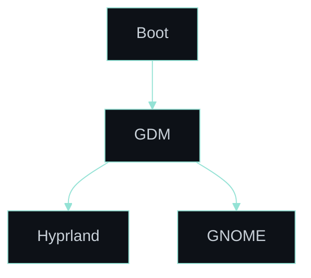

<div align="center">
  
  <h1>NixOS dotfiles</h1>

  <div align="center">
    
    
    
    
    
    
    
    
    
    <a href="https://github.com/RomeoCavazza/nixos-config/actions/workflows/ci.yml"></a>
  </div>
</div>

A reproducible, single-host NixOS workstation: a Hyprland/GNOME desktop on a LUKS-encrypted disk behind Secure Boot with TPM2 unlock, SOPS-managed secrets, and an integrated Prometheus/Loki/Grafana stack. Assembled from a constellation of small, pinned repositories.


---

## Documentation

The [**GitHub Wiki**](https://github.com/RomeoCavazza/nixos-config/wiki) is the primary reference:

- [Architecture](https://github.com/RomeoCavazza/nixos-config/wiki/Architecture) — how the flake, profiles, and modules assemble the machine.
- [Modules](https://github.com/RomeoCavazza/nixos-config/wiki/Modules) — what each system module does and why.
- [Security](https://github.com/RomeoCavazza/nixos-config/wiki/Security) — disk encryption, verified boot, secrets, and backups.
- [Observability](https://github.com/RomeoCavazza/nixos-config/wiki/Observability) — dashboards, correlation logs, and live snapshots.

```
.
├── flake.nix        # Inputs + the `legion` output
├── flake/           # mk-host, quality, profile selection
├── profiles/        # Composable feature bundles (system + home)
├── hosts/legion/    # Host config + hardware-configuration.nix
├── modules/         # System modules by domain
├── home/tco/        # Home Manager (packages/, hyprland/, ...)
├── lib/             # palette, colors, fonts, locality
├── pkgs/ overlays/  # Custom packages + nixpkgs overlays
├── config/          # Local scripts and Grafana sources
└── secrets/         # SOPS-encrypted secrets
```

---

## Constellation

This dotfile is not a monolith — it is composed from small, single-purpose repositories, each pinned as a flake input and documented on its own:

| Repository | Role |
|---|---|
| [`hyprland-config`](https://github.com/RomeoCavazza/hyprland-config) | Hyprland compositor, Waybar, Rofi, foot |
| [`conky-config`](https://github.com/RomeoCavazza/conky-config) | Transparent Conky telemetry rails |
| [`hypr-canvas`](https://github.com/RomeoCavazza/hypr-canvas) | Native infinite-canvas Hyprland plugin |
| [`hyprspace`](https://github.com/RomeoCavazza/hyprspace) | Workspace overview plugin |
| [`hyprchroma`](https://github.com/RomeoCavazza/hyprchroma) | Chromakey transparency plugin |
| [`nvim-config`](https://github.com/RomeoCavazza/nvim-config) | Neovim configuration |
| [`emacs-config`](https://github.com/RomeoCavazza/emacs-config) | Doom Emacs configuration |
| [`grafana-config`](https://github.com/RomeoCavazza/grafana-config) | Grafana dashboards (Jsonnet) |
| [`ventoy-config`](https://github.com/RomeoCavazza/ventoy-config) | Multiboot recovery USB |

---

## Desktop

> [!TIP]
> GDM offers both desktops at login — switch between **Hyprland** (Wayland) and **GNOME** without friction.



### GNOME


<br>

### Hyprland


<br>

### Neovim


<br>

### Virtualization


<br>

### Hardware and Modeling


<br>

### System Metrics


<br>

### NVIDIA Prime


---

## Live Infrastructure


Prometheus, Loki, Grafana, and Promtail provide local observability. The snapshots committed on the `snapshots` branch are documentation artifacts only, refreshed by a systemd timer when the visual delta exceeds 0.3%. Live operations stay in Grafana.

- [NixOS Metrics](https://raw.githubusercontent.com/RomeoCavazza/nixos-config/snapshots/docs/assets/live/live-dashboard.png) — current pressure and rebuild cost
- [Nix Efficiency](https://raw.githubusercontent.com/RomeoCavazza/nixos-config/snapshots/docs/assets/live/nix-efficiency.png) — freshness, generation debt, closure structure
- [Incident Correlation](https://raw.githubusercontent.com/RomeoCavazza/nixos-config/snapshots/docs/assets/live/incident-dashboard.png) — pressure spikes mapped to Loki logs

Details on the [Observability](https://github.com/RomeoCavazza/nixos-config/wiki/Observability) wiki page.

---

## Security and Backups

The disk is LUKS-encrypted and unlocked by a TPM2 keyslot behind Secure Boot ([Lanzaboote](https://github.com/nix-community/lanzaboote)); the layout is declarative via [disko](https://github.com/nix-community/disko). Secrets are committed only in encrypted form under [`secrets/`](./secrets/) with [sops-nix](https://github.com/Mic92/sops-nix). Backups use `restic` to Backblaze B2, split into `b2-critical` and `b2-data`, with a weekly non-destructive restore drill. Full model on the [Security](https://github.com/RomeoCavazza/nixos-config/wiki/Security) wiki page.

---

## Installation

> [!IMPORTANT]
> This configuration targets a specific host — review hardware IDs, filesystems, secrets, and service assumptions before reusing it. Features are enabled by composing profiles in [`profiles/`](./profiles/), which the host assembles in [`hosts/legion/profiles.nix`](./hosts/legion/profiles.nix).

Prerequisites: a [NixOS ISO](https://channels.nixos.org/nixos-unstable/latest-nixos-graphical-x86_64-linux.iso) on a bootable USB ([Ventoy](https://www.ventoy.net/en/download.html) or [Rufus](https://rufus.ie/en/)).

```bash
# 1. Back up the current config
sudo cp -r /etc/nixos /etc/nixos-backup

# 2. Clone
git clone https://github.com/RomeoCavazza/nixos-config.git ~/dev/nixos-config

# 3. Apply
cd ~/dev/nixos-config && sudo nixos-rebuild switch --flake .#legion
```
